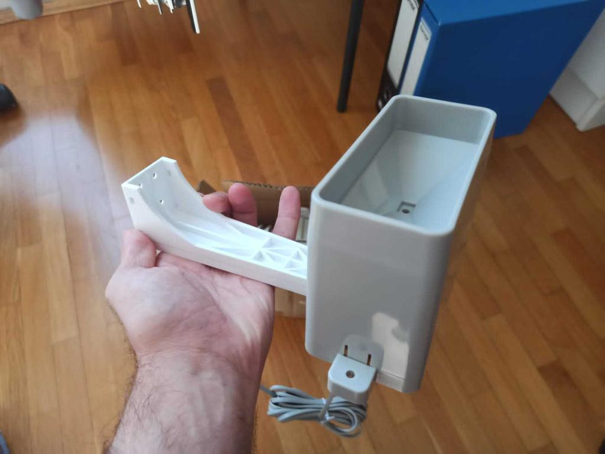
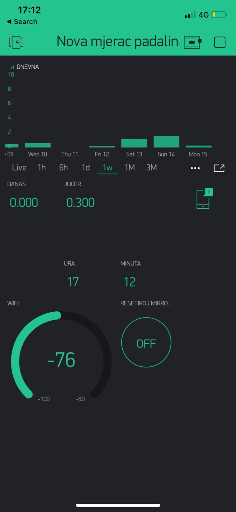

# Rain-Gauge-Esp8266-NTP-RTC
# Mjerač padalina Esp8266 Blynk NTP RTC

Using Croduino Nova2 ESP8266, Blynk, Arduino OTA, NTP servers, RTC internal clock and precipitation sensor, a precipitation meter was made. Since the rainfall measurement is reset every day at midnight, the microcontroller needs to know what time it is. Each time the microcontroller is started and connected to the Internet, it pulls the time from the NTP server and starts the internal RTC clock with the obtained time value. Because if the time was constantly withdrawn from the NTP server in case of being left without an Internet network, the rainfall value would not be reseted at midnight, so it only withdraws time from the NTP server once and later relies on the internal RTC.

Koristeći Croduino Nova2 ESP8266, Blynk, Arduino OTA, NTP servere, RTC sat i senzor padalina napravljen je mjerač padalina. Pošto se mjerenje padalina resetira svaki dan u ponoć, mikrokontroleru je potrebno znati koliko je sati. Pri svakom pokretanju mikrokontrolera i spajanju na internet, povuče vrijeme sa NTP servera i sa dobivenom vrijednosti vremena pokreće unutarnji RTC sat. Jer ako bi se stalno povlačilo vrijeme od NTP servera u slučaju ostanka bez internetske mreže vrijednost padalina se u ponoć ne bi resetirala pa samo jednom povlači vrijeme sa NTP servera te se kasnije oslanja na unutarnji RTC. 

